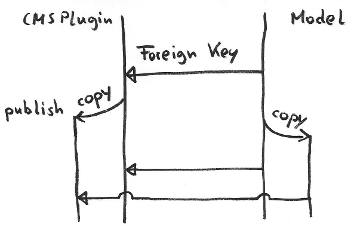
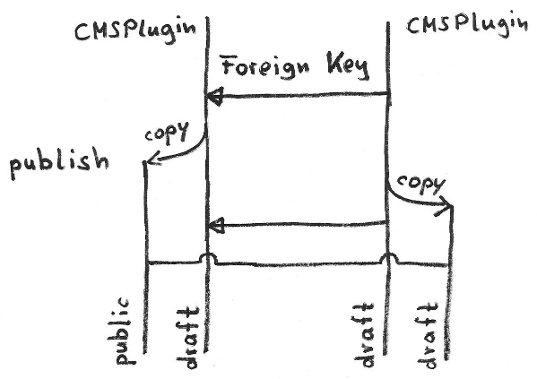
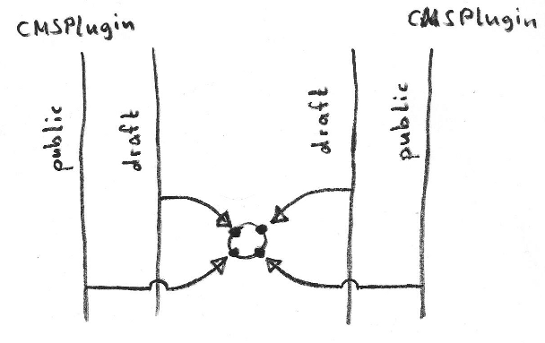

# djangocms-relations

Handling relations for custom cmsplugins

## Installation

`$ git clone git@github.com:philippze/djangocms-relations.git <yourfolder>`

`$ pip install -r test_requirements/django-1.7.txt`

## Running tests (Currently: Error)

`cd <yourfolder>` 

`./TEST`

## Roadmap

1. Create a working ManyToManyField to another CMSPlugin
2. Create little helpers as an alternative to defining `copy_relations` for every relation field.
3. Think about a solution for ForeignKeys
4. Ideas about optimizing relations between CMSPlugins and usual models might appear.

## The problem with relations

In the Django CMS,
as soon as a page is published every CMSPlugin exists in two versions.
A public and a draft version.
There is no direct link between them.

When we publish changes on a page,
the CMSPlugins of the public version will be deleted
and replaced by copys of the draft version's plugins.

## Standard-Solution: ForeignKey from model to CMSPlugin

If there is a foreign key from a model to a CMSPlugin,
we have to create a copy of the model instance
when publishing the CMSPluigin.

The new copy of the original instance will be related
to the public version of the CMSPlugin
while the model instance we edit should have a relation
with the draft version of the CMSPlugin.

This graphic shows what happens.

## The problem with relations between two CMSPlugins

Creating a copy of the model instance where the ForeignKey comes from
conflicts with the concept of one draft and one publich version of a CMSPlugin.

Applying the usual copying mechanism will result in two draft versions as the following graphics shows.

## A concept for dealing with many to many fields

We should store two ForeignKeys for each side of the ManyToMany intermediate model.
On for the draft and one for the public version, each.
This is illustrated here.

There are a few things we need to change when starting from the usual ManyToManyField.

1. Auto-generate an intermediate model with two more fields.
2. Care about the error message that appears if there are two ForeignKeys to the same model.
3. Change the `contribute to model` method in a way that the contributed property yields either the draft or the published related object, depending on the draft status of the object itself.
4. Organize the publishing. When one CMSPlugin is published, the new copy must point to the published-end of the intermediate model.
